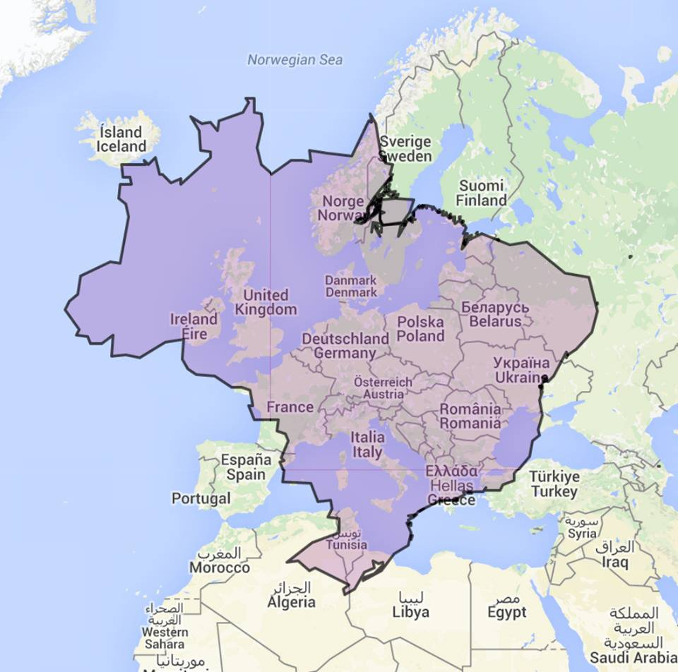

```{r setup, include=FALSE}
options(htmltools.dir.version = FALSE)
```

```{r, eval=FALSE, echo=FALSE}
# Make sure you use the xaringan version 
# from my github, so it has the maynooth template ---
devtools::install_github("brunaw/xaringan")
```

# Who am I


.pull-left[

- Undergraduate in Statistics, 2018, 
Federal University of Paraná

- Originally from Curitiba, Paraná, Brazil
- Lived in São Paulo during 2018 


## R-Ladies Groups

  - Curitiba 
  - São Paulo
]

.pull-right[
```{r, out.width="85%", fig.align='center', echo = FALSE}

```
]

.pull-left[
```{r, out.width="30%", fig.align='center', echo = FALSE}
knitr::include_graphics("rladies.png")
```
]


---

```{r, out.width="90%", fig.align='center', echo = FALSE}

```

---

```{r, out.width="82%", fig.align='center', echo = FALSE}

```

---
class: inverse, middle, center


# Study

---

# Interests

### What I know well

  - Frequentist Statistics & Machine Learning
  - R
  - Shiny

### What I want to learn more
  - Python
  - Bayesian Statistics
  - Paper writing

### Websites
  - http://brunaw.com/
  - https://r-music.rbind.io/

---

# Graduation Thesis

### Title: Chord Based Feature Extraction for Genre Classification in Popular Brazilian Music 

> Goal: extract music chords data and transform it 
to verify if harmonic structures are enough to 
predict music genre. 

  - Extraction of a big set of music chords via
  webscraping.
  - Resulting R package: `chorrrds`
    - 2000+ downloads on CRAN
    
  - Feature extraction (of the chords) for 
  creating more representative variables about the 
  songs. 
  - Use of the Spotify API for extracting more
  variables. 
  - Random forests for predicting the 
  music genre of each song. 

---

# Supervisors

### Graduation Thesis: Prof. Dr. Walmes Zeviani

  - Machine learning
  - Non-linear modelling
  - Computational statistics
  - Experimental design


### Scientific Initiation: Prof. PhD. Wagner Bonat

  - Multivariate regression models 
  - Study & construction of multivariate distributions
  - Computational statistics

```{r, fig.align='center', out.width="40%", echo = FALSE}
knitr::include_graphics("leg.png")
```

---
class: inverse, middle, center


# Work 

---

### Internships

  - HSBC/Bradesco Bank: Credit risk modelling with 
  logistic regression. 

  - City Hall of Pinhais: Geostatistical data 
  analysis on the financial situation of the 
  people living in Pinhais.

### Jobs
  
  - Teaching: private classes of R & statistics. 
  
  - Some freelance statistical consulting.
  
  - Statistician at Priced: Analysis of expenditure 
  data in São Paulo - data wrangling, product 
  elasticity and churn, consumers behaviour
  clusterization.

---

class: center, middle

# Thanks!

Github: @brunaw

