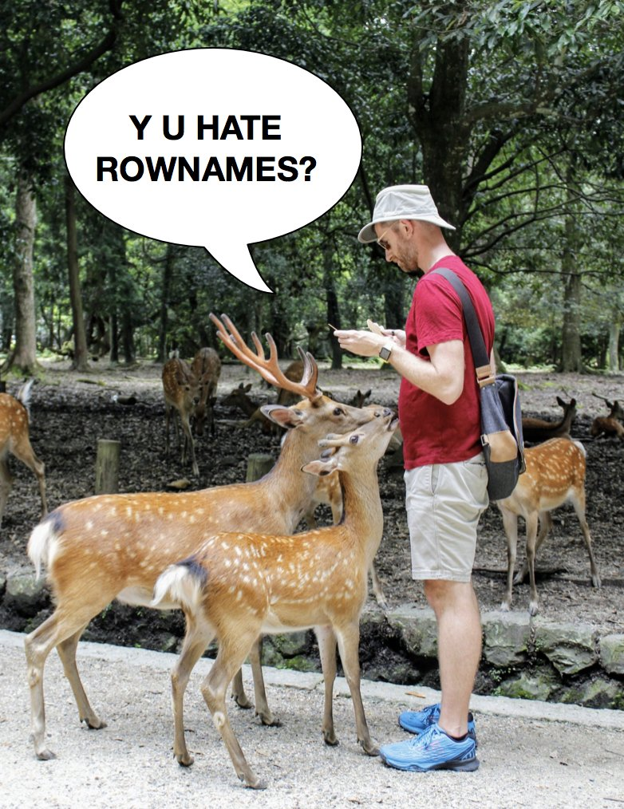
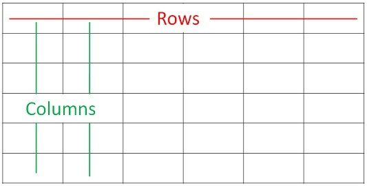

```{r setup, include=FALSE}
options(htmltools.dir.version = FALSE)
knitr::opts_chunk$set(warning = FALSE, message = FALSE, 
  comment = NA, dpi = 300,
  fig.align = "center", out.width = "70%", cache = FALSE)
library(tidyverse)
```

```{r, eval=FALSE, echo=FALSE}
# Make sure you use the xaringan version 
# from github, so it has the maynooth template ------------------------
devtools::install_github("brunaw/xaringan")
```


class: inverse, middle, center

# Welcome. 


---

class: left

# The *tidyverse* package


>  The tidyverse is an opinionated collection of R packages designed for data science. All packages share an underlying design philosophy, grammar, and data structures.  

```{r, echo = FALSE, out.width="55%", fig.align='center'}
knitr::include_graphics("img/tidy_workflow.png")
```

```
install.packages("tidyverse")
```

---

class: left

# The packages

```{r, eval = FALSE}
library(tidyverse) 
tidyverse::tidyverse_packages()
```


  * `ggplot2`: pretty plots,based on The Grammar of Graphics
  * `dplyr`: data manipulation
  * `tidyr`:  a set of functions that help you get to tidy data.
  * `readr`: readr provides a fast and friendly way to read rectangular data 
  * `purrr`: functional programming
  * `tibble`: a modern re-imagining of the data frame
  * `magrittr`: provides the pipe `%>%`  
  * `stringr`:  a cohesive set of functions to deal with strings
  * `forcats`: useful tools that solve common problems with factors
  * `lubridate`: functions to deal with dates
  
  
---

class: left

# The book 


```{r, echo = FALSE, out.width="35%", fig.align='center', fig.cap="Book: R for Data Science, Hadley Wickham & Garrett Grolemund"}
knitr::include_graphics("img/ds.png")
```

---

class: left

# The main author of the packages

.pull-left[

```{r, echo = FALSE, out.width="95%"}

```
]

.pull-right[
```{r, echo = FALSE, out.width="75%"}

```

]

---

class: left

# The data format

```{r, echo = FALSE, out.width="75%"}

```


Paper: [Tidy Data, Hadley Wickham](https://www.jstatsoft.org/article/view/v059i10/v59i10.pdf)

---
class: middle, center

## The Kaggle challenge

Bike Sharing Demand

---


# The goal

> You are provided hourly rental data spanning two years. For this competition, the training set is comprised of the first 19 days of each month, while the test set is the 20th to the end of the month. You must predict the **total count of bikes rented during each hour** covered by the test set, using only information available prior to the rental period.


**Steps:**

  1. Read data and separate in train and test (70%-30% usually)
  2. Wrangle data
  3. Explore the data
  4. Build a model
  5. Evaluate your predictions

---

# 1. Reading data and creating the  train-test variable 


```{r}
set.seed(2018)
df <- read_csv("data/Kaggle/bike_sharing/train.csv") %>% 
  mutate(set = ifelse(runif(n = dim(.)[1]) > 0.7, "test", "train")) %>% 
  as.data.frame()

df %>% 
  count(set) %>% 
  mutate(prop = scales::percent(n/sum(n))) %>% 
  select(set, prop)
```


---

# 1. Reading data and separate it in train and test

```{r}
# Take a look at the data
glimpse(df)
```

---

# 2. Wrangle data

The goal is to predict the hourly **count** of bikes rented. 
We need to find a way to wrangle the data so it can be appropriate for
the problem. 

  - Extract the hour of each rental
  - Extract the data of each rental
  - Extract the month of each rental
  - Think about a reasonal way to create new variables

But...what does it mean to predict a count?


---
class: middle, center

## Pause. Let us talk a little bit about modelling.

---

# Statistical modelling

**Statistical modeling** is a way to approximate reality
(the process generating your data) with a mathematical function. The model
can usually be described by a equation. 

> Everything that involves probability is a model. 


.pull-left[
Suppose you are flipping a coin. If your coin is unbiased, it is natural 
to expect that both the probability of heads and tails are the same and
equal to 0.5. 

So, the model for the coin flipping is:
$P(flip = head) = P(flip = tail) = 0.5$ 

The coin has only two possibilities: heads and tails, which 
configures a **discrete distribution**. 
] 

.pull-right[
```{r, echo = FALSE, out.width="75%"}
knitr::include_graphics("img/coin.png")
```

]


---

# Usual models

  - Probabilistic Models
  - Linear Regression
  - Generalised Linear Models
  - Decision/regression Trees
  - Time Series Models
  - Support Vector Machine Models
  - Neural Networks
  - etc

# Usual variable types 

  - Binary
  - Continuous, unlimited
  - Factors
  - Counts
  - Times
  - Diverse: text, images, audio, etc. 
 
---

# The count case 

If you have a count random variable, the most common used model for it
is the Poisson distribution. It can be proved that a count generating
process has the form

$$ P(Y = y) = \frac{\lambda^{y} exp\{-\lambda\}}{y!}, \quad  \lambda >  0$$
**where $\lambda$ is interpreted as the rate in which the count 
process happens**. What this means is that the probability of the
variable $y$ assuming some value is given by the above equation. 

**And why are we even talking about that?**

Well, in real life, we never know what $\lambda$ is: is it 0.5? is it 2?
is it 3.14? What we can assume is that $y$ depends on some covariables 
$x = (x_1,\dots,x_n)$ and that we can estimate $\lambda$
with these covariables. In this way, by having the information 
about the covariables, we can **predict** our target variable y. Great!

---

class: middle, center

### Fine. But I still don't know how the $x$ are related to $y$. 

```{r, echo = FALSE, out.width="15%"}
knitr::include_graphics("img/think.png")
```

---

# Some details about poisson regression

Regression is a classic statistical method and the details can 
be actually extensive. The most important thing is that we
can assume 

$$ \lambda = exp(\beta_0 + \beta_1 \phi(x_1) + \dots + 
\beta_n \phi(x_n))$$
$$log(\lambda) = \beta_0 + \beta_1 \phi(x_1) + \dots + 
\beta_n \phi(x_n) $$


Or, in words, that the $log(\lambda)$ is equal to a sum of the
values of the covariables multiplied by a vector of coefficients
and an intercept. Each coefficient measures what changes in the
$log(\lambda)$ when we add one unity of the each variable
(e.g. $\beta_1$ measures the difference that happens in 
$log(\lambda)$ when $x_1$ increases
by one). 

Then we have some optimization methods to find values of 
$\beta$ that are the more consistent with the data provided. 


---

# Back to 2. Wrangle data


A little introduction about the `dplyr` functions and the `pipe` (`%>%`) :

 * The `pipe`, or `%>%` (ctrl + shift + m), is an operator that
 applies to the data in the **left** the function that is in the **right**, e.g
 
```{r}
iris %>% head()
```

---

# Back to 2. Wrangle data

The five main functions of the `dplyr` package are: 
  * `mutate()`: add or modify variables. 
  * `select()`: select/discard variables.
  * `filter()`: filter by some criteria.
  * `summarise()`: summarises the data. 
  * `arrange()`: sorts the data.  

All of these functions can be combined!

  * `group_by()`: performs operations within groups.

Extensions are made with predicates: `_all`, `_if`, `_at`, `_each`

---

# Back to 2. Wrangle data

Remember that we have to organise better the data so we can actually work 
with it. How is that done?


```{r}
# Creating new variables
df <- df %>% 
  mutate(hour = lubridate::hour(datetime),
         day = lubridate::day(datetime),
         month = lubridate::month(datetime), 
         day_of_week = lubridate::wday(datetime)) %>% 
  dplyr::select(-datetime)

df %>% slice(1:6)
```


---

# Back to 2. Wrangle data

We can think about creating variables that represent something
different in ou dataset. 
```{r}
# Creating new variables
df <- df %>% 
  mutate(class_register = 
           ifelse(registered < quantile(registered, 0.3), "Low", 
                  ifelse(registered < quantile(registered, 0.7), "Medium", 
                         "High")))

df %>% 
  count(class_register) %>% 
  mutate(prop = scales::percent(n/sum(n))) %>% 
  select(class_register, prop)
```


---

# 3. Explore the data

You can use: 
  - Plots
  - Proportion tables
  - Summaries
  
Suppose you want to check if the distribution of the count is different for each season of the year: 

```{r, eval = FALSE}
df %>% 
  ggplot(aes(count)) +
  geom_histogram(fill = 'plum', colour = 'black') +
  facet_wrap(~season) +
  labs(x = 'Response varibable', y = 'Counts of the histogram') +
  theme_bw()
```


---

# 3. Explore the data

```{r, echo = FALSE, fig.width = 5.7, fig.height = 4.5}
df %>% 
  ggplot(aes(count)) +
  geom_histogram(fill = 'plum', colour = 'black') +
  facet_wrap(~season) +
  labs(x = 'Response variable', y = 'Counts of the histogram') +
  theme_bw()
```


---

# 3. Explore the data

```{r}
df %>% skimr::skim()
```


---

# 4. Build a model

First, let us separate the final data into train and test set. This
is done so we can have some sample of the data that *was not seen*
by the model, then we can evaluate the quality of the model with it. 
```{r}
# Separating the final data into train and test set
train_data <- df %>% filter(set == 'train') %>% as.data.frame()
test_data <- df %>% filter(set == 'test') %>% as.data.frame()
```


Declaring our model in R: 

```{r}
my_model <- glm(count ~  day + hour + temp + month + atemp + 
                  humidity + day_of_week + class_register + 
                  windspeed + holiday + workingday + casual,
                data = train_data, family = poisson)
```

---

```{r}
summary(my_model)
```


---

# 5. Evaluate your predictions

```{r}
# Creating the prediction
test_data$prediction <- stats::predict(my_model, 
                                       newdata = test_data, type = 'response')

# Checking our error
sqrt(sum((log(test_data$count) - log(test_data$prediction))^2)/dim(test_data)[1])
```


---

Predicted  *versus* observed 

```{r, fig.width=3.5, fig.height=3}
test_data %>% 
  ggplot(aes(count, prediction)) +
  geom_point(colour = 'royalblue', alpha = 0.75) +
  labs(y = 'Predicted', x = 'Observed') + theme_bw()
```


---
Possible extra steps are:

  - More data wrangling
  - More creation of new variables & data exploration
  - Dimensionality reduction, for when there are a lot of columns
  - Testing different models to choose the best one


---

# Image example

The explanatory variables are **extracted** from the imagem, 
a matrix  $\mathbf X = \{x_{ijk}\}_{N\times M \times R}$, in which:  

- $N$ is the number of lines, 
- $M$ is the number of columns  
- $R$ is the number of *colours*, or *channels*

The $x_{nm\cdot}$ element is a *pixel*. 

```{r, fig.cap="Pratap Singh, Bhupendra", echo = FALSE}
knitr::include_graphics("img/matrix-rgb.png")
```


---

class: center, middle, inverse

# Thanks!

 

<b>

[@brunaw](https://github.com/brunaw)


