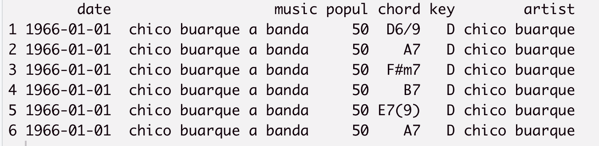
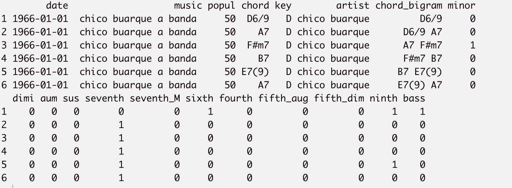
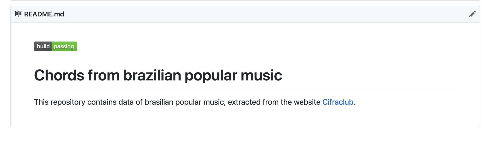

```{r setup, include=FALSE}
options(htmltools.dir.version = FALSE)
knitr::opts_chunk$set(warning = FALSE, message = FALSE, 
                      comment = NA, dpi = 300,
                      fig.align = "center", 
                      out.width = "70%", 
                      cache = FALSE,
                      echo = FALSE)
library(tidyverse)
```


# Summary

- Adding new functions to the `chorrrds` package

- Writing the `README` of the package

- Reviewing a package for `rOpenSci`


---

# Adding new functions to to the `chorrrds` package

> Package: `chorrrds`
  GitHub: `https://github.com/r-music/chorrrds`

Goals:
  - Extract music chords for any artist;
  - Provide auxiliar datasets and functions to analyse the
    music chords.  

**New functionalities:**     

- `feature_extraction()`: 
  - Extracts useful features from a chords dataset;
  - Useful to representat the chords in a better way than just
  a string;
  
- `chords_ngram()`: 
  - Contructs the chords bigrams (or n-grams) for a chords dataset;
  - Useful to work with structural dependencies in chords; 

---

# Before

Suppose we have some generic chords data: 

```{r, out.width="120%"}

```


---

# After

> 13 new columns to the data 

```{r, out.width="120%"}

```


---

# Writing the `README` of the package

Minimum elements: 
  - Badges: 
    - code coverage, 
    - documentation, 
    - [Travis](https://travis-ci.org/),
    - downloads from CRAN. 
  - Summary of the package and its functionalities;
  - Installation guide, examples and references; 
  - Citation; 
  - Contribution guide. 

---

# README - Before

```{r}

```

---

# README - After

[Click here!](https://github.com/r-music/chorrrds/)

Note: the `code coverage` is still incomplete,
so the badge is not there :)

---

# Reviewing a package for `rOpenSci`

 - `rOpenSci`: a community that promotes the transformation
of science through open data & software. 

 - Their packages are reviewed as they were papers, but the
 review is open (and more humane). 

> Package reviewed: `rromeo`

>  GitHub: `https://github.com/Rekyt/rromeo`

>  Theme: extract information on editorial policies of 
  scientific journals regarding the archival of preprint, 
  postprint and publishers’ manuscripts.

---

# Reviewing a package for `rOpenSci`

Goals: 
  - Check if the package has a clear statement of need and
  target audience;
  - Focus on the usability of the package:
    - User friendly interface,
    - Enough examples. 

  - Check if the functions and examples work; 
  - Check if the functions and arguments are named to work 
  together to form a common, logical programming API that is easy
  to read, and autocomplete. 
  - Make general suggestions about how the package can
  improve. 

> [Review page](https://github.com/ropensci/software-review/issues/285#issuecomment-472069821)

---


class: center, middle, inverse

# Thanks!

 

<b>

[@brunaw](https://github.com/brunaw)